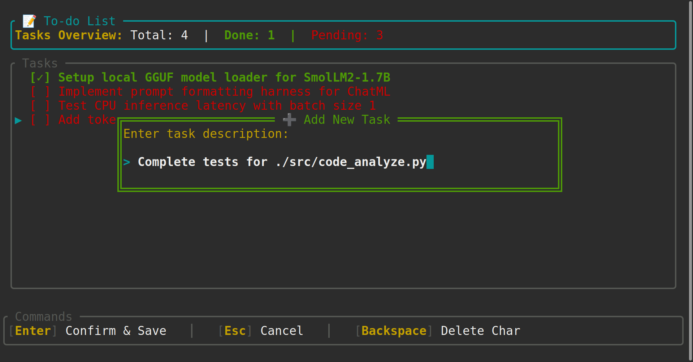

# ⚡ Tomy

> **A blazing-fast, all-in-one terminal workspace and code harness designed for Python developers and on-device AI experimentation.**

Tomy brings the power of a modern code editor, a live execution runner, an interactive file explorer, and an AI workbench directly into your terminal. Built with 100% Rust and [Ratatui](https://github.com/ratatui/ratatui), it starts up instantly, uses minimal system memory, and lets you write, format, lint, and run Python code without ever touching a heavy graphical IDE.

---

## 📸 Screenshots & UI Showcase

Here is a look at Tomy in action:

### 1. Interactive Python Code Editor
A distraction-free terminal editor featuring syntax highlighting, live token counting, automatic 4-space indentation, word skipping/deletion, and full mouse support.


---

### 2. Dual-Terminal Live Output Runner & Scratchpad
Write code in one window and watch the output stream live in a dedicated companion terminal window. It automatically re-runs your script the instant you save!


---

### 3. Split-Screen Project File Explorer
Browse your project tree on the left and see an instant file preview with line numbers and token metrics on the right.


---

### 4. Built-in Task & Experiment Tracker
Keep track of model evaluations, benchmark checklists, and development to-dos right inside your workspace.


---

## 🌟 What Makes Tomy Special? (In Plain English)

Most code editors and AI harnesses are bloated desktop applications that consume gigabytes of RAM and take seconds to load. **Tomy takes the opposite approach:**

1. **Lightweight & Instant:** Launches in milliseconds inside your terminal. It runs smoothly on everything from high-end workstations to low-power laptops and remote SSH servers.
2. **Zero-Config Python Formatting:** Powered by in-process [Ruff](https://github.com/astral-sh/ruff). Press `Ctrl+S` or `Ctrl+R`, and your code is instantly cleaned, formatted to PEP 8 standards, and checked for lint issues automatically.
3. **Know Your AI Context (Live Token Counting):** When working with Large Language Models (LLMs), knowing token count is critical. Tomy counts exact tokens using OpenAI's `tiktoken` engine across your files and editor buffer in real-time.
4. **Dual-Window Feedback Loop:** No more switching tabs or manually typing `python3 script.py` after every edit. Tomy opens an execution runner terminal beside your editor that auto-refreshes on every save.
5. **Smart Symbol Autocomplete:** As you type, Tomy looks at the classes, variables, and keywords in your code and suggests completions without lagging.

---

## 🚀 Key Features

### 💻 1. Intelligent Terminal Code Editor
- **Familiar Keybindings:** Navigate effortlessly with `Ctrl+Left`/`Ctrl+Right` (word jump), `Ctrl+Backspace` (delete word), `Ctrl+A` (select all), and `Home`/`End`.
- **Clipboard Integration:** Seamless `Ctrl+C` (copy) and `Ctrl+V` (paste) using your system clipboard (`wl-copy`, `xclip`, or `xsel`).
- **Mouse Selection & Dragging:** Click and drag your mouse across code lines to highlight and copy text.
- **Ruff Auto-Fix:** Automatically fixes common Python mistakes (like unused imports or bad spacing) the moment you save.
- **Smart Indentation:** Automatically aligns indentation when you press `Enter` after colons (`:`) or control flow statements, and indents 4 spaces with `Tab` / unindents with `Shift+Tab`.
- **Font Size Zoom:** Quick HUD adjustment via `Ctrl +` and `Ctrl -`.

### 🧪 2. Dual-Window Output Runner
- **Secondary Terminal Window:** Spawns a dedicated output window that captures standard output in crisp white/green and errors in highlighted red.
- **Save-to-Run Sync:** Hit `Ctrl+R` or save your file, and the runner automatically detects the change, re-executes `python3`, and streams results.
- **Performance Metrics:** Displays execution runtime in milliseconds (`ms`), process exit status, and the token count of the output.
- **Interactive Output Controls:** Scroll up/down through long logs, re-run manually with `r` or `Enter`, and copy all terminal output with `c`.

### 📁 3. Workspace File Explorer
- **Two-Column View:**
  - **Left (45%):** Hierarchical folder tree with expand/collapse (`Enter`), clear color coding for folders and files, and nested depth indicators.
  - **Right (55%):** Live preview pane showing file contents with line numbers and token metrics before you open it.
- **Project Actions:**
  - `Ctrl+N`: Create a new file directly in the active folder.
  - `Del`: Delete a file or directory (with double-safety confirmation prompts for non-empty folders).
- **Auto-Detection:** Automatically spots Python entrypoints (like `main.py`, `app.py`, `src/main.py`) when you open a project folder.

### 🔢 4. High-Speed Token Counter
- **Multi-Engine Support:** Switch between `cl100k_base` (standard for GPT-4, Claude, and Llama) and `o200k_base` (GPT-4o) with a single tap in Settings.
- **Engineered for Speed:**
  - Small files ($< 64\text{ KB}$): Superfast direct memory read.
  - Medium files ($64\text{ KB} - 256\text{ KB}$): Kernel zero-copy memory mapping via `memmap2`.
  - Large files ($> 256\text{ KB}$): Parallel multi-threaded chunking across CPU cores using `rayon`.

### 📝 5. Tasks & Checklist Tracker
- Track to-do items, model evaluation runs, and experiment benchmarks.
- Toggle task completion with `Space` or `Enter`.
- Add new tasks with `a` or `n`, delete with `d` or `Del`.
- Real-time statistics banner showing total, completed, and pending tasks.

### 💬 6. AI Chat & Prompt Playground(in development)
- Conversational chat screen formatted for small, local language models (like SmolLM2, Qwen2.5-Coder, or Llama 3.2).
- Clean bubble layouts differentiating user prompts and assistant replies.
- Scrollable message history with mouse wheel and arrow keys.
- Quick history wipe with `/clear`.

### ⚙️ 7. Settings & Configuration (in development)
- Toggle active BPE tokenization standards.
- View and manage model paths, inference context sizes, sampling temperatures, and CPU thread limits.

---

## ⌨️ Quick Keyboard Reference

### Global Navigation
| Key | Action |
| :--- | :--- |
| `↑` / `↓` or `k` / `j` | Move up / down through menus and lists |
| `Enter` | Open selected screen or confirm action |
| `Esc` | Return to previous menu / Main Menu |
| `q` | Quit Tomy (from Home screen) |
| `Ctrl+C` | Force quit Tomy cleanly |

### Code Editor
| Key | Action |
| :--- | :--- |
| `Ctrl+S` | Save file, format with Ruff, and apply lint fixes |
| `Ctrl+R` | Save file, run Ruff, and trigger live Output Runner |
| `Ctrl+A` | Select all text in editor |
| `Ctrl+C` | Copy selected text (or entire line if none selected) |
| `Ctrl+V` | Paste text from system clipboard |
| `Ctrl+←` / `Ctrl+→` | Jump backward / forward by word |
| `Ctrl+Backspace` / `Ctrl+W` | Delete word behind cursor |
| `Ctrl +` / `Ctrl -` | Increase / decrease font scale HUD |
| `Tab` | Insert 4 spaces (or accept autocomplete suggestion) |
| `Shift+Tab` | Unindent current line 4 spaces |
| `Enter` | Newline with smart automatic indentation |
| `Esc` | Return to File Explorer or Main Menu |

### File Explorer
| Key | Action |
| :--- | :--- |
| `↑` / `↓` or `k` / `j` | Navigate files and folders |
| `Enter` | Expand/collapse folder or open file in Editor |
| `Ctrl+N` | Create new file |
| `Del` | Delete selected file or folder |
| `Esc` | Return to Main Menu |

### Dual-Terminal Output Runner
| Key | Action |
| :--- | :--- |
| `r` or `Enter` | Re-run script manually |
| `c` or `Ctrl+C` | Copy complete runner output to clipboard |
| `↑` / `↓` / `PageUp` / `PageDown` | Scroll through output |
| `Home` / `End` | Jump to top / bottom of output |
| `q` or `Esc` | Close runner window |

### Tasks / To-Do Screen
| Key | Action |
| :--- | :--- |
| `Space` or `Enter` | Toggle completed / pending |
| `a` or `n` | Add a new task |
| `d` or `Del` | Delete selected task |
| `Esc` | Cancel editing or return to Main Menu |

---

## 🛠️ Installation & Getting Started

### Prerequisites
- **Linux** (Ubuntu, Debian, Fedora, Arch, etc.)
- **Rust toolchain** (`cargo` and `rustc` edition 2024 or newer): [Install Rust](https://rustup.rs/)
- **Python 3** installed and available in your `$PATH` as `python3`
- *(Optional)* `xclip`, `xsel`, or `wl-copy` for system clipboard support
- *(Optional)* `zenity` for native Linux folder picker dialogs

### 1. Clone the Repository
```bash
git clone https://github.com/avisheksharmacoder/Tomy.git
cd tomy
```

### 2. Build and Run
To build and launch Tomy immediately:
```bash
cargo run --release
```

Or install it locally to your cargo bin directory:
```bash
cargo install --path .
tomy
```

### 3. Launch Modes (in development)
- **Full Workspace:** Just run `tomy` to enter the main dashboard.
- **Standalone Runner:** You can also run the output runner directly on any Python file from your terminal:
  ```bash
  tomy runner path/to/script.py
  ```

---

## 🧩 Project Architecture

```
tomy/
├── Cargo.toml               # Rust package dependencies & configuration
├── screenshots/             # Product screenshots and UI showcases
└── src/
    ├── main.rs              # Application entrypoint & terminal initialization
    ├── app.rs               # Main application coordinator & state machine
    ├── editor.rs            # Ratatui code editor, mouse selection, and HUD
    ├── runner.rs            # Companion terminal output runner & auto-reload
    ├── explorer.rs          # Two-column directory tree & file previewer
    ├── ruff_service.rs      # In-process Ruff linter, formatter & AST symbols
    ├── completion.rs        # Autocomplete popup and prefix matching
    ├── token_counter.rs     # Multi-threaded tiktoken counter (mmap + rayon)
    ├── home.rs              # Main menu dashboard
    ├── chat.rs              # Small LLM chat interface
    ├── code.rs              # Coding model harness preview
    ├── todo.rs              # Task checklist & experiment tracker
    └── settings.rs          # BPE tokenizer & model configuration
```

---

## 📄 License

This project is licensed under the MIT License. Feel free to use, modify, and distribute it in your own projects.
